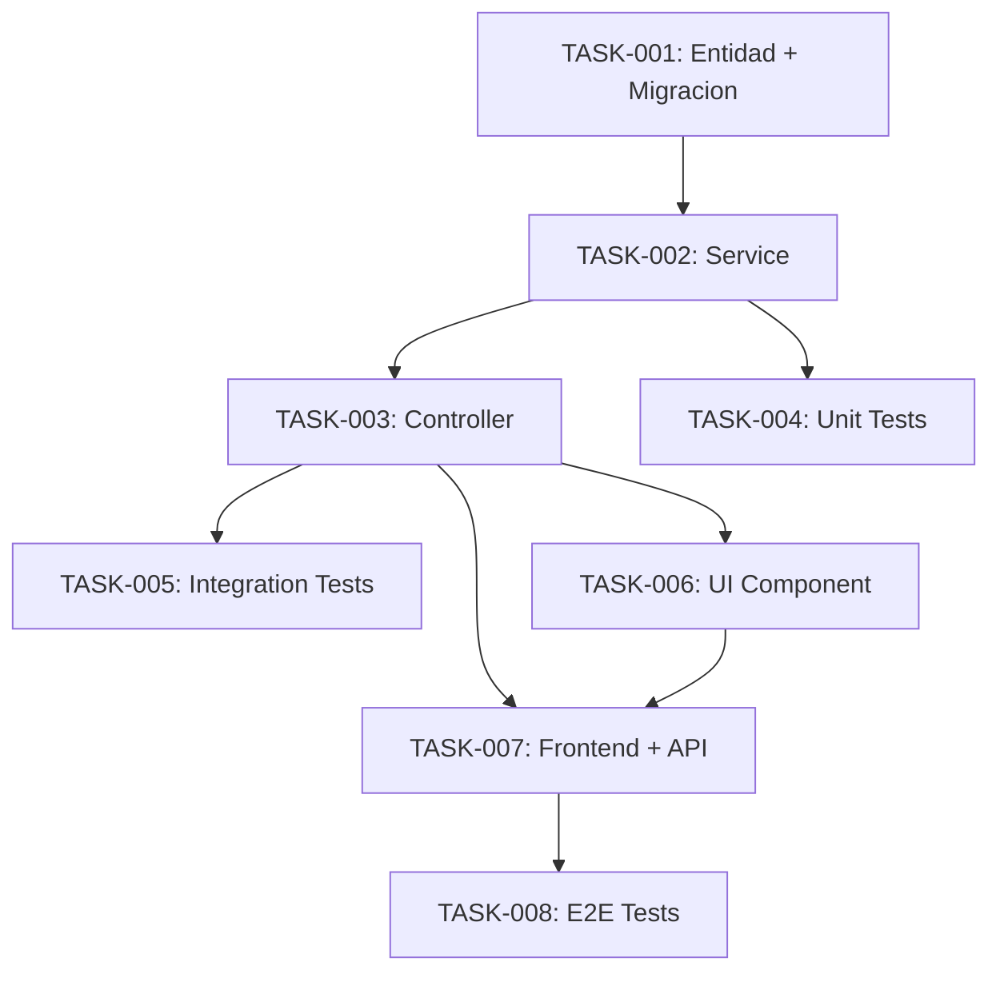

# Feature Plan: [NOMBRE DE LA FEATURE]

**Fecha**: YYYY-MM-DD
**Estado**: Pendiente | En progreso | Completada
**Prioridad**: Alta | Media | Baja

---

## Descripcion

Breve descripcion de la feature y el valor que aporta al usuario.

## Requisitos Funcionales

1. ...
2. ...

## Requisitos No Funcionales

- Performance: ...
- Seguridad: ...
- Accesibilidad: ...

---

## Contrato de API

### Endpoints Nuevos / Modificados

| Metodo | Ruta              | Request Body       | Response Body      | Descripcion        |
|:-------|:------------------|:-------------------|:-------------------|:-------------------|
| POST   | /api/example      | CreateExampleDto | ExampleResponse  | Crea un ejemplo    |
| GET    | /api/example/{id} | —                  | ExampleResponse  | Obtiene un ejemplo |

### DTOs / Schemas

```typescript
// Request Body
interface CreateExampleDto {
  name: string;
  description: string;
}

// Response Body
interface ExampleResponse {
  id: string;
  name: string;
  description: string;
  createdAt: string;
}
```

---

## Tareas

| ID       | Titulo                               | Agente   | Dependencias | Prioridad | Estado     |
|:---------|:-------------------------------------|:---------|:-------------|:----------|:-----------|
| TASK-001 | Crear entidad y migracion Example    | Backend  | —            | Alta      | Pendiente  |
| TASK-002 | Implementar ExampleService           | Backend  | TASK-001     | Alta      | Pendiente  |
| TASK-003 | Crear ExampleController              | Backend  | TASK-002     | Alta      | Pendiente  |
| TASK-004 | Tests unitarios de ExampleService    | Testing  | TASK-002     | Alta      | Pendiente  |
| TASK-005 | Tests de integracion de API          | Testing  | TASK-003     | Media     | Pendiente  |
| TASK-006 | Componente UI ExampleForm            | Frontend | TASK-003     | Alta      | Pendiente  |
| TASK-007 | Integrar frontend con API            | Frontend | TASK-003,006 | Alta      | Pendiente  |
| TASK-008 | Tests E2E del flujo completo         | Testing  | TASK-007     | Media     | Pendiente  |

---

## Diagrama de Dependencias



---

## Notas y Decisiones de Diseño

- ...

## Riesgos Identificados

- ...
