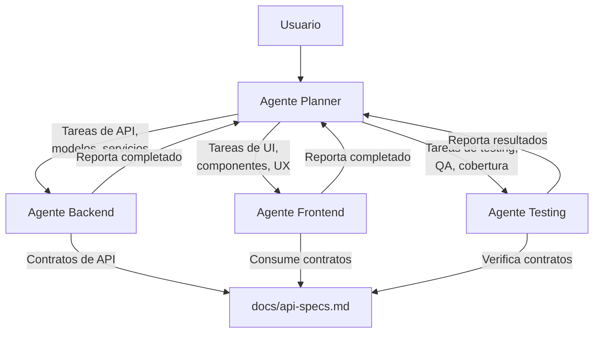

# Workflow Multi-Agente: Arquitectura y Metodología

Este proyecto utiliza un modelo de colaboración multi-agente con roles especializados, coordinados por un agente Planner central.

---

## Arquitectura del Workflow

---

## Agentes del Sistema

### 1. Agente Planner (Orquestador)
- **Skill**: `planner-workflow`
- **Rol**: Analiza requisitos, diseña features, descompone en tareas, asigna trabajo a los demás agentes, coordina contratos de API y verifica la completitud.
- **NO escribe código de producción.**

### 2. Agente Frontend
- **Directorio**: `frontend/`
- **Skills**: `frontend-workflow`, `impeccable`
- **Rol**: Construye UI, componentes, estado, navegación y experiencia de usuario.

### 3. Agente Backend
- **Directorio**: `backend/`
- **Skills**: `backend-workflow`
- **Rol**: Implementa APIs, servicios de negocio, modelos de datos, autenticación y persistencia.

### 4. Agente Testing / QA
- **Directorio**: `tests/`
- **Skills**: `testing-workflow`
- **Rol**: Diseña y ejecuta pruebas unitarias, de integración y E2E. Verifica contratos y cobertura.

---

## Flujo de Ejecución por Feature

1. **Usuario** describe la feature al **Planner**.
2. **Planner** analiza, clarifica dudas, y produce un plan con tareas ordenadas.
3. **Planner** define contratos de API en `docs/api-specs.md`.
4. **Planner** delega tareas a Backend, Frontend y Testing respetando dependencias.
5. Cada agente ejecuta su tarea y reporta resultado.
6. **Planner** verifica, coordina correcciones si hace falta, y cierra la feature.

---

## Coordinación e Intercambio de Información

- Los contratos y especificaciones de API viven en `docs/api-specs.md`.
- Los planes de features se documentan en `docs/features/`.
- Cada directorio de trabajo tiene su `AGENTS.md` con reglas locales.
- La plantilla para nuevas features está en `.agents/skills/planner-workflow/templates/feature-plan-template.md`.
